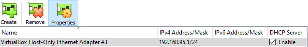
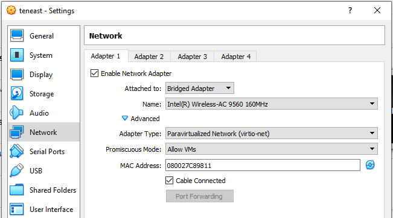
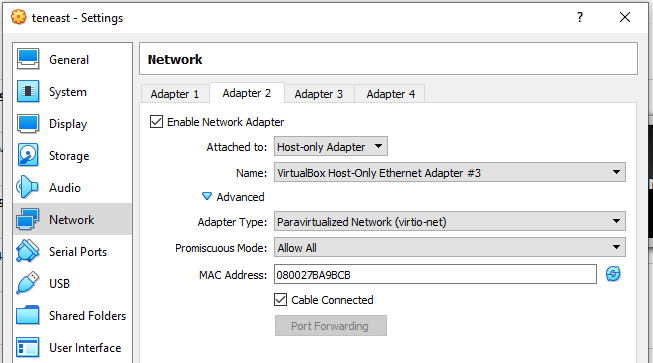

# GRFICSv2
Version 2 of the Graphical Realism Framework for Industrial Control Simulation (GRFICS)

#### Pre-built VMs

1. Download VMs:

Simulation VM (MD5 checksum e59b65222d9da143fe13118635caa1d5):

https://drive.google.com/open?id=1ZN7u_WPUGHsEeos09NITpLImbeU9LKpI

2. Add a host-only adapter in VirtualBox with IP address 192.168.95.1 and 255.255.255.0 netmask (https://www.virtualbox.org/manual/ch06.html#network_hostonly)
Your VirtualBox settings should look something like the below screenshots.

3. Import each VM into VirtualBox using File->Import Appliance

4. Every VM can be logged into with username "user" and password "password"

5. Log into the simulation VM and open 2 terminals. In one, cd into the "simulation" directory and run "./simulation". In the second terminal, cd into the simulation/remote_io directory and run "sudo bash remote_io.sh"
