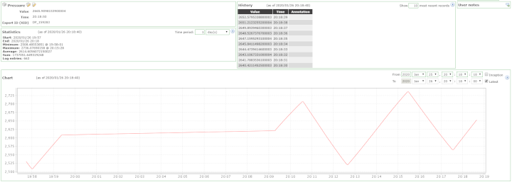
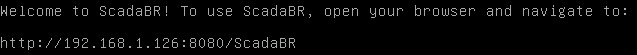
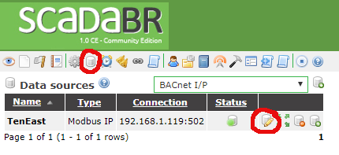
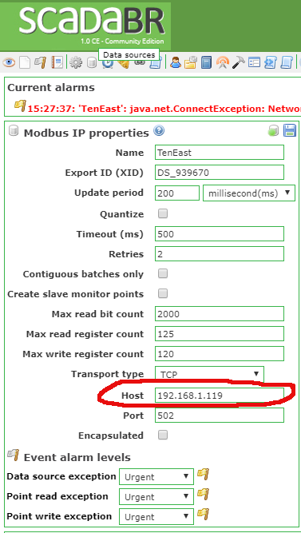

# ScadaBR
ScadaBR is both an HMI and historian

#### HMI

#### Historian

### Installation
1. [Install ScadaBR on a Debian server virtual machine](https://www.openplcproject.com/reference-installing-scadabr), first using a NAT adapter to make installation easier.

2. Power the VM off and change the network adapter to the host-only 192.168.90.0/24 network. Set the static IP address to 192.168.90.5 by using `sudo nano /etc/network/interfaces` and making the file look like 
`auto lo
iface lo inet loopback

allow-hotplug enp0s3
iface enp0s3 inet static
address 192.168.90.5
netmask 255.255.255.0
up route add -net 192.168.95.0 netmask 255.255.255.0 gw 192.168.90.100`

Note that the last line is necessary for the VM to know how to route through the pfSense router.

3. On your host machine, point your browser to the ScadaBR web interface.  The URL should be displayed on your ScadaBR virtual machine terminal

4. Click the "Import/Export" icon

5. In the "Import Project (Upload)" field, click "Choose File" to upload the .zip project file

6. Click "Send"

7. Click "Import"

8. To point ScadaBR to the IP address of the PLC, click on the "Data Source" icon, the "Edit Source" icon, and then edit the IP, as shown in the below screenshots

### Usage
The default username and password are "admin"

Click the "Watchlist" button to view historian data.  Click the "Graphical Views" button to view the HMI.

